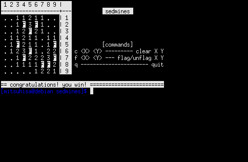

# sedmines


> :bomb: Minesweeper game written in GNU sed

## Description

**sedmines** is a text-based Minesweeper game written in GNU sed.



## Video Demo

[](https://www.youtube.com/watch?v=2LihQipVPWY)

## Requirements

- `sed` ([GNU sed](https://www.gnu.org/software/sed/))
- `seq` and `shuf` ([GNU coreutils](https://www.gnu.org/software/coreutils/))

## Installation

```shell
git clone https://github.com/mikkun/sedmines.git
```

## How to Play

### Running the Game

```console
$ cd /path/to/sedmines⏎

# Press [↵ Enter] twice to start a new game
$ ./sedmines.sed⏎
⏎
```

### Commands

- <kbd>c <em>X</em> <em>Y</em></kbd> or <kbd>c<em>X</em><em>Y</em></kbd>: Clear *X* *Y*
- <kbd>f <em>X</em> <em>Y</em></kbd> or <kbd>f<em>X</em><em>Y</em></kbd>: Flag/Unflag *X* *Y*
- <kbd>q</kbd>: Quit

## License

[GNU General Public License v3.0 or later](./LICENSE)

## Author

[KUSANAGI Mitsuhisa](https://github.com/mikkun)
